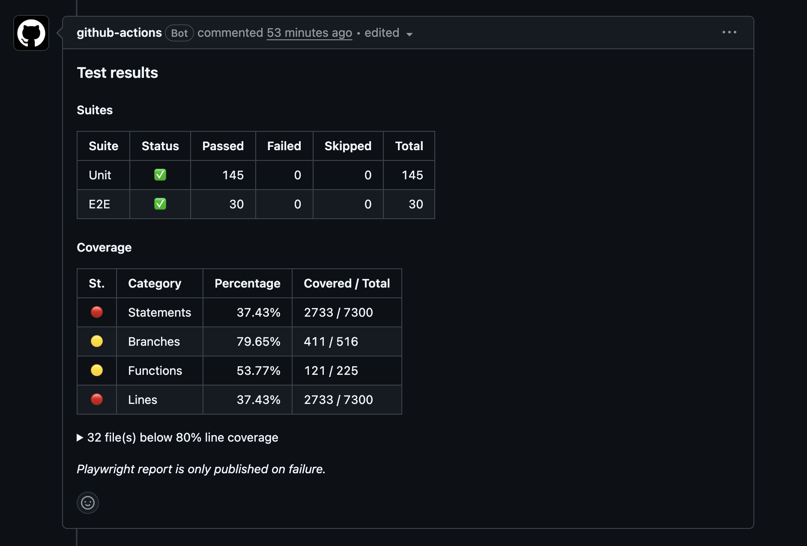

# action-test-report-comment

Sticky PR comment with a unified test report: coverage table, suite counts, an opt-in per-file weak-spots list, and an optional Playwright report link appended from a downstream job.

Renders both Jest's `coverage-report.json` (`--json --coverage --testLocationInResults`) and Vitest's v8 `coverage-summary.json` natively.

## Example



## Minimal example

Coverage only — no junit, no Playwright:

```yaml
- uses: mesh-payments/action-test-report-comment@v1
  with:
    coverage-report: ./coverage-report.json
```

Posts a single sticky comment with a Coverage table. No per-file weak-spots block (opt in with `weak-files`), no Suites table, no Playwright footer.

## Full example

Coverage + unit junit + e2e junit + opt-in flag + Playwright two-job append:

```yaml
jobs:
  ci:
    runs-on: ubuntu-latest
    outputs:
      e2e_outcome: ${{ steps.e2e.outcome }}
    steps:
      - uses: actions/checkout@v4
      - uses: actions/setup-node@v4
        with: { node-version-file: package.json }
      - run: npm ci
      - run: npm test          # produces ./junit.xml + ./coverage/coverage-summary.json
      - id: e2e
        env:
          RUN_E2E: ${{ vars.RUN_E2E == '1' && '1' || '' }}
        run: npm run test:e2e  # produces ./playwright-junit.xml

      - if: always() && github.event_name == 'pull_request'
        uses: mesh-payments/action-test-report-comment@v1
        with:
          coverage-summary: ./coverage/coverage-summary.json
          unit-junit: ./junit.xml
          e2e-junit: ./playwright-junit.xml
          e2e-opt-in: ${{ vars.RUN_E2E == '1' && '1' || '' }}
          e2e-skip-note: 'E2E is gated on `RUN_E2E` and did not run on this PR.'
          playwright-footer-note: ${{ steps.e2e.outcome == 'failure' && 'Playwright report link will be appended below once the Pages deploy completes.' || 'Playwright report is only published on failure.' }}

  deploy-playwright-report:
    needs: ci
    if: ${{ failure() && needs.ci.outputs.e2e_outcome == 'failure' && github.event_name == 'pull_request' }}
    runs-on: ubuntu-latest
    permissions: { pages: write, id-token: write, pull-requests: write }
    environment: { name: github-pages, url: ${{ steps.deploy.outputs.page_url }} }
    steps:
      - id: deploy
        uses: actions/deploy-pages@v4
      - uses: mesh-payments/action-test-report-comment@v1
        with:
          playwright-report-url: ${{ steps.deploy.outputs.page_url }}
          playwright-append-note: Report includes screenshots, video, and trace viewer per failure.
```

## Append mode

The `playwright-report-url` input switches the action into **append mode**. Use it from a downstream job that only knows the report URL after a Pages deploy completes — instead of posting a second sticky, it appends a separator + URL block to the comment the first job posted.

The match key is `comment-header` (default `test-results`). Pass the same value on both calls.

The two-job pattern:

1. **Job 1** runs your tests, calls the action with `coverage-*` (and optionally `unit-junit` / `e2e-junit`). The action posts the initial sticky.
2. **Job 2** runs only when E2E failed and the Pages deploy succeeded, then calls the action again with only `playwright-report-url` (no coverage inputs). The action appends the report URL to the existing sticky.

If job 2 fires without job 1 having posted (race / misconfiguration), append mode logs a warning and exits cleanly — it does not create a new comment.

## Inputs

At least one of `coverage-summary` or `coverage-report` is required. In append mode (`playwright-report-url` set), all coverage inputs are ignored.

| Name | Required | Default | Description |
|:-----|:---------|:--------|:------------|
| `coverage-summary` | one of | — | Path to a v8 `coverage-summary.json`. Example: `./coverage/coverage-summary.json`. |
| `coverage-report` | one of | — | Path to a Jest `coverage-report.json` (the `--json --coverage --testLocationInResults` shape). Example: `./coverage-report.json`. |
| `unit-junit` | no | — | Path to a unit-test JUnit XML. When set, renders the Unit row in the Suites table. |
| `e2e-junit` | no | — | Path to an E2E JUnit XML. When set, renders the E2E row. All other `e2e-*` inputs are no-ops without this. |
| `e2e-opt-in` | no | `''` | Truthy when the repo's E2E opt-in flag is on. Empty/unset → E2E row reads `_skipped (opt-in)_`. |
| `e2e-feature-name` | no | `E2E` | Label rendered in the E2E row (e.g. `E2E (RUN_E2E)`). |
| `e2e-skip-note` | no | `''` | Blockquote rendered under the Suites table when the E2E row is "skipped (opt-in)". |
| `weak-files` | no | `false` | Render the per-file weak-spots `<details>` block. **Off by default** — the list is sorted worst-first, so publishing it on every PR reads as a ranked worklist of files to add tests to rather than as a report. |
| `weak-threshold` | no | `80` | Lines-coverage % below which a file appears in the weak-spots `<details>` block. No effect unless `weak-files` is on. |
| `weak-limit` | no | `50` | Cap on rows in the weak-spots table. When exceeded, summary reads `showing X of Y`. No effect unless `weak-files` is on. |
| `comment-header` | no | `test-results` | Sticky-comment marker. Use the same value across jobs that should share a comment. |
| `playwright-report-url` | no | — | When set, the action runs in **append mode**: appends a Playwright report block to the existing sticky. |
| `playwright-footer-note` | no | `''` | Optional blockquote at the end of the comment (replace mode only). |
| `playwright-append-note` | no | `''` | Optional trailing line in the appended Playwright block. |
| `github-token` | no | `${{ github.token }}` | Token used to read/write the PR comment. |

## Outputs

| Name | Description |
|:-----|:------------|
| `comment-action` | One of `created`, `updated`, `appended`, `skipped`. |
| `comment-id` | The issue-comment ID (when created/updated/appended). |
| `comment-body` | The rendered markdown body (replace mode only). |

## Versioning

Two ways to pin:

- `mesh-payments/action-test-report-comment@v1` — **moving major tag** (recommended). Floats forward over backwards-compatible additions inside `v1.*`.
- `mesh-payments/action-test-report-comment@v1.0.0` — **pinned exact**. Use this when you need byte-stability across renders (e.g. matching a tool that diffs comment text).

## What this action deliberately doesn't do

- **No coverage delta vs base.** Renders absolute coverage only. Real delta needs base-branch coverage from somewhere the runner can reach (stored artifact, separate run) — out of scope for v1. Slated for a future `@v2` with explicit opt-in.
- **No threshold-based check failure.** This is a PR-comment formatter, not a gating check. Use a separate step (or a coverage tool's own thresholds) for that.
- **No inline diff annotations.** Out of scope for v1.

## Development

```bash
npm install
npm test         # node:test, no test runner deps
npm run lint
npm run build    # ncc → dist/index.js (committed)
```

Tests cover:

- Coverage-only Jest call (no Suites, no Playwright footer).
- Single-suite Unit-only.
- Full Vitest + E2E + Playwright.
- Missing-junit fallback.
- Weak-files cap with `showing X of Y`.
- Weak-files off by default, and rendered when opted in.
- Opt-in-off → E2E row reads `_skipped (opt-in)_`.
- Append-mode body for the Playwright report.

`dist/index.js` is committed (vendored) — that's how JavaScript actions work. CI verifies it stays in sync with `src/`.

## License

[MIT](./LICENSE).
